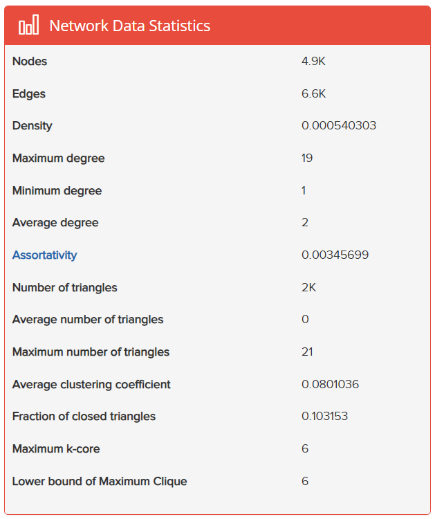

#  Elektrik Şebekelerinde Kırılganlık ve Kritik Altyapı Analizi


Bu proje, Ege Üniversitesi Bilgisayar Mühendisliği Yüksek Lisans Programı "Çizge Teorisinde Ölçüm Parametreleri" dersi kapsamında, **elektrik dağıtım ve iletim şebekelerinin topolojik kırılganlıklarını** analiz etmek amacıyla geliştirilmiştir. Şebeke operasyonları ve veri biliminin kesişiminde yer alan bu çalışma, fiziksel sistemlerin siber-fiziksel zafiyetlerini proaktif olarak tespit etmeyi hedefler.

##  Projenin Amacı ve Kapsamı
Modern elektrik şebekelerini "Çizge Teorisi (Graph Theory)" kullanarak modelliyor, ağ üzerindeki zafiyetleri, kaskad (zincirleme) arıza potansiyellerini ve sistemin belkemiğini oluşturan "kritik altyapı" düğümlerini algoritmik olarak tespit ediyoruz.

Temel Ölçüm Metriklerimiz:
* **Arasındalık Merkeziliği (Betweenness Centrality):** Şebeke üzerindeki güç akışında dar boğaz (bottleneck) yaratabilecek en kritik trafo merkezlerinin tespiti.
* **En Büyük Bağlı Bileşen (Largest Connected Component - LCC):** Olası bir düğüm kaybında (arıza/saldırı) ağın fiziksel bütünlüğünün nasıl parçalandığının ölçülmesi.

##  Veri Seti (Dataset)
Projede, Duncan Watts ve Steven Strogatz'ın çalışmalarında da yer alan, ABD Batı Yakası yüksek gerilim iletim şebekesini topolojik olarak modelleyen açık kaynaklı `power-US-Grid` veri seti kullanılmaktadır. 



*(Veri Seti İstatistikleri - Kaynak: Network Repository)*

##  Kurulum ve Kullanım (Installation & Usage)
Projeyi kendi yerel ortamınızda çalıştırmak için aşağıdaki adımları izleyebilirsiniz.

**1. Repoyu Klonlayın:**
```bash
git clone [https://github.com/hakkikeman/mpgt-power-grid-analysis.git](https://github.com/hakkikeman/mpgt-power-grid-analysis.git)
cd mpgt-power-grid-analysis
```

**2. Gereksinimleri Yükleyin:**
```bash
pip install -r requirements.txt
```

**3. Çalıştırın:**
```bash
python src/power_grid_analysis.py
```         